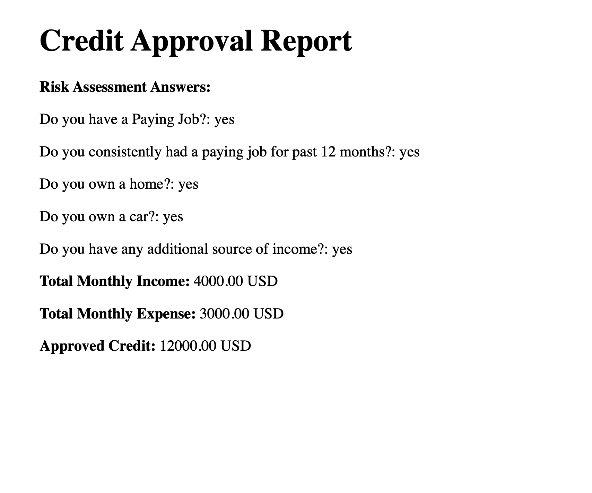

# Credit Approval App

A Phoenix (Elixir) web application that simulates a **credit approval system**.  
The app collects user responses to a risk assessment questionnaire, calculates credit points, and based on eligibility:

- If **not eligible**: Displays a rejection message.  
- If **eligible**:  
  1. Collects monthly income and expenses.  
  2. Calculates the maximum credit limit.  
  3. Asks for the user’s email.  
  4. Generates a **PDF report** with all answers.  
  5. Sends the PDF to the provided email using **Swoosh**.

---

## Features

- Phoenix app **without a database**.
- Risk assessment form with 5 questions.
- Points calculation logic:
  - Paying Job → 4 points
  - Consistent 12 months job → 2 points
  - Own House → 2 points
  - Own Car → 1 point
  - Additional Income → 2 points
- Threshold:  
  - `≤ 6 points` → Credit Denied  
  - `> 6 points` → Proceed to income & expense form
- Credit calculation: `(income - expense) * 12`.
- PDF report generation (using `ChromicPDF`).
- Email sending with **Swoosh** + SMTP. (Right now only local server is working)

---

## Installation

### Prerequisites
- Elixir 1.16+ / Erlang 26+
- Phoenix 1.7+

### Steps
1. Clone the repository:
  ```bash
  git clone https://github.com/anirudh-1304/credit_approval_app.git
  cd credit_approval_app
  ```
2. Install dependencies:
  ```bash
  mix deps.get
  ```
3. Configure Email (SMTP):
  In config/dev.exs, update your SMTP settings.
  ```bash
  config :credit_approval_app, CreditApprovalApp.Mailer,
  adapter: Swoosh.Adapters.Local, ### To get rid of tls and other issues with google
  relay: "smtp.gmail.com",
  username: "your_email@gmail.com",
  password: "your_app_password",
  port: 587,
  ssl: false,
  tls: :always,
  auth: :always
  ```

  For tests, use the test adapter (no real emails sent) in config/test.exs:
  ```bash
  config :credit_approval_app, CreditApprovalApp.Mailer,
  adapter: Swoosh.Adapters.Test
  ```

4. Run the phoenix server:
  ```bash
  mix phx.server
  ```

5. Visit http://localhost:4000/risk_assessment in your browser.

---

### Flow
1. Risk assessment form(/risk_assessment)
  - User answers 5 yes/no questions.
2. Decision
  - If points ≤ 6: Show credit denied page.
  - If points > 6: Redirect to /credit_approved.
3. Income & Expense Form
  - Collect total monthly income & expenses.
4. Credit Calculation
  - Display:
  ```bash
  Congratulations, you have been approved for credit up to X USD
  ```
5. Email Form (/email_form)
  - Ask user for email address.
6. PDF Generation + Email Sending
  - Generate Assessment_report.pdf and send to the provided email.
  - Sample report
  
7. Check emails on local server
  - On the browser open http://localhost:4000/dev/mailbox

---

### Running Test
- Run all tests
  ```bash
  mix test
  ```
- Tests cover:
  - Risk assessment controller flow.
  - Credit calculation.
  - PDF generation (checks if file exists and is not empty).
  - Email sending (via Swoosh.Adapters.Test).
